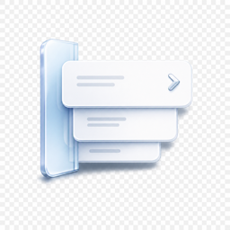

# Shelf



Shelf is being migrated from the original Python/PyObjC app to a native Swift macOS app.

The Swift version watches the frontmost app, extracts context hints from supported apps, matches those hints against Contacts, and offers automation actions for the current app/contact pair.

Supported hint sources:

- Safari, Chrome, Edge, and Brave active tabs
- Mail selected messages
- Finder selected files
- Contacts selected people
- Generic focused-window title fallback through Accessibility

Supported automation actions include opening Contacts records, composing Mail messages, opening Messages, navigating the current browser tab to a contact URL, moving selected Mail messages to suggested folders, revealing Finder selections, copying contact summaries, and returning focus to the hinted app.

Build the native app:

```sh
make native-app
open dist/Shelf.app
```

For development:

```sh
make native-run
```

The original Python/PyObjC source is preserved under `legacy/` for reference, and the legacy py2app build remains available through `make legacy-dist`.
