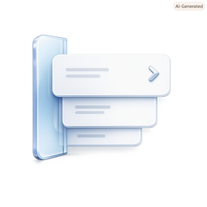

# Shelf



Shelf is being migrated from the original Python/PyObjC app to a native Swift macOS app.

The Swift version watches the frontmost app, extracts context hints from supported apps, matches those hints against Contacts, and offers automation actions for the current app/contact pair.

Supported hint sources:

- Safari, Chrome, Edge, and Brave active tabs
- Mail selected messages
- Slack conversations, observed messages, links and attachments through bounded Accessibility reads
- Finder selected files
- Contacts selected people
- Generic focused-window title fallback through Accessibility

Supported automation actions include opening Contacts records, composing Mail messages, opening Messages, navigating the current browser tab to a contact URL, moving selected Mail messages to suggested folders, revealing Finder selections, copying contact summaries, and returning focus to the hinted app.

Mail messages also offer reply/reply-all/forward drafts for a single bound message,
copying sender/message details, and opening up to three links from the message preview,
without requiring a Contacts match. Draft actions revalidate the selection and never send.

Slack adds open/copy actions for conversation and explicitly focused message links.
Drafts are excluded and Slack display names are not treated as Contacts identities.
See [Slack context coverage and limits](docs/slack-context.md).

Build the native app:

```sh
make native-app
open dist/Shelf.app
```

Local app builds use ad-hoc signing, with no Keychain certificate dependency.
Privacy permissions may need to be granted again after rebuilding. To use a
certificate explicitly, set `SHELF_CODESIGN_IDENTITY` to its identity or fingerprint;
certificate signing alone does not establish Gatekeeper acceptance or notarization.

For development:

```sh
make native-run
```

The original Python/PyObjC source is preserved under `legacy/` for reference, and the legacy py2app build remains available through `make legacy-dist`.

The reusable [typed decision foundation](docs/typed-decisions.md) lives in
`Packages/TypedDecisions` and uses the built-in Apple Intelligence model through public
Swift contracts. Mail folder assessment is optional and starts in shadow mode; existing
suggestions and user-confirmed actions remain the baseline. The package includes offline
tests, a JSONL replay tool and an independent consumer example.
